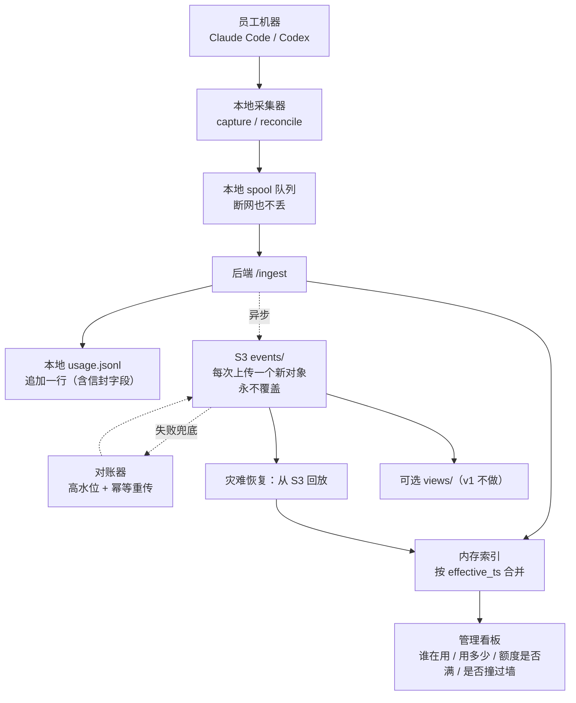

# Vantage S3 存储设计（定稿）

日期：2026-07-17
规模假设：约 100 用户，Claude Code + Codex 双工具。

## 1. 设计目标

Vantage 采集团队成员的 AI 工具使用情况（会话用量、内容摘要、额度状态）。S3 在系统中的定位不是数据库，也不是实时查询引擎，而是**可靠的、不可变的持久归档层**。

核心目标：

- 不丢数据：每次上传都被永久记录。
- 不覆盖历史：会话后续变化、额度刷新、额度撞墙都保留痕迹。
- 结构简单：目录层级少，管理成本低。
- 写入安全：后端是唯一写入者（AWS 密钥不下发到员工机器），多人同时上传不互相覆盖。
- 完整恢复：本地数据丢失后可从 S3 重建出与丢失前**等价**的状态——这要求归档不丢字段（见 §4）。
- 可扩展：数据量变大时可平滑升级为批量 JSONL，语义不变。

一句话总结：

> S3 只负责"不忘"。当前状态、去重、统计，全部通过回放 events 计算出来。

## 2. 最终目录结构

```text
s3://vantage-prod/
  events/
    dt=YYYY-MM-DD/                         # dt = received_at（服务端收到时间）的 UTC 日期
      <received_at紧凑格式>_<event_id>_<tool>.json

  views/                                   # 可选派生视图，v1 不实现
    daily/
      user=<姓名>/
        dt=YYYY-MM-DD.json
```

示例：

```text
s3://vantage-prod/
  events/
    dt=2026-07-17/
      20260717T093012.015Z_01J9X7K2M4_codex.json
      20260717T100205.455Z_01J9XB8TQ1_claude-code.json
      20260717T101530.900Z_01J9XGH3W8_codex.json
```

- `events/` 是唯一真相：每次上传一个新对象，只新增、不修改、不删除。
- `views/` 是从 events 计算的缓存，可覆盖、可删除、可重建；v1 不实现。

### 2.1 为什么分区用 received_at（服务端钟），不用 observed_at（客户端钟）

1. 员工机器的时钟不可信：时区配错、主板电池没电会把事件写进错误的 `dt=` 分区，污染分区和未来的生命周期管理。
2. 本地 spool 队列会离线积压（设计如此），重传时往"旧分区"回填，会让按天运行的下游任务（如 views 生成）永久漏掉迟到事件。按 received_at 分区则迟到事件自然落在"到达日"，分区到点封口。
3. 后端是单写入者，received_at 单调递增，key 天然有序。

`observed_at` 保留在 JSON 内容里，用于表达"真实发生时间"和回放排序（见 §6）。

### 2.2 为什么不按 hour 再细分

每天约 3000 个对象，LIST 分页（1000/页）3 页取完；key 以时间戳开头，单日内天然按时间排序，人工排查无需按小时下钻。将来量级真上去，重分区是一次批量拷贝的事，代价很低。

### 2.3 为什么文件名不含身份（姓名 / user_id）

- 身份是**数据**，不是**地址**：放在 JSON 内容里，改名、部门纠偏、未来引入工号都不影响目录结构。
- 中文姓名做 key 虽合法（S3 支持 UTF-8），但徒增工具链摩擦。
- 服务端自造 user_id（注册表或哈希）要么引入有状态组件及其同步问题，要么无实际可读性，在 100 人规模是负收益；姓名在 roster 内唯一，现有身份体系（姓名 + roster 校验 + 纠偏重传）已够用。重名出现时的扩展路径见 §13。

## 3. events 文件名规则

```text
<received_at>_<event_id>_<tool>.json
```

- `received_at`：服务端收到时间，UTC 紧凑格式 `20260717T093012.015Z`。
- `event_id`：服务端生成的 ULID。**唯一性由它保证**——同一毫秒多人上传也不冲突。
- `tool`：`codex` / `claude-code`，方便人工浏览。

## 4. event 数据格式：信封 + 原样透传

设计原则：

> event = 服务端信封字段 + 现有 UsageRecord 全部字段**原样透传**，不裁剪、不重塑、不改名。

即：S3 中的每个 event 对象 ≈ 服务端本地 `usage.jsonl` 的一行（StoredRecord），外加 `event_id` 和 `observed_at` 两个字段。由此得到三个性质：

- **零映射代码**：采集端将来新增字段自动进入归档，无需维护字段映射表。
- **恢复等价性**：从 S3 回放 = 从 usage.jsonl 回放，语义逐字节等价（§9 的承诺因此成立）。
- **对账直接**：本地 JSONL 就是对账重传的数据源（§8）。

信封字段：

| 字段 | 生成方 | 含义 |
|---|---|---|
| `event_id` | 服务端 | ULID，全局唯一；文件名组成部分；对账重传的幂等键 |
| `observed_at` | 采集端（**新增字段**） | 生成本快照的本地 UTC 时间。SessionEnd 钩子 ≈ ended_at；reconcile 重传 = 扫描时刻。用于回放时判断"哪份快照更新" |
| `received_at` | 服务端（已有） | 服务端收到时间。分区与文件名使用它 |

其余字段与 `server/src/store.ts` 的 `UsageRecord` 完全一致：

- 身份：`name` / `department` / `machine`（遗留数据含 `email`）
- 会话：`tool` / `session_id` / `model` / `project` / `started_at` / `ended_at` / `duration_ms`
- 用量：`user_messages` / `assistant_messages` / `tool_calls` / `input_tokens` / `output_tokens` / `total_tokens` / `cache_read_tokens` / `cache_creation_tokens` / `cache_creation_5m_tokens` / `cache_creation_1h_tokens` / `reasoning_tokens` / `by_model`
- 额度（仅 Codex）：`quota_primary_pct`（5 小时短窗，已用百分比）/ `quota_secondary_pct`（周长窗）/ `quota_plan`（套餐）/ `quota_reached`（**字符串**，撞墙类型；`null` = 未撞）
- 内容：`first_prompt` / `summary` / `exit_reason`（采集端已 `redact()` 脱敏）
- 去重：`dedupe_key`（= `tool:session_id`）

示例（一条 Codex 撞墙事件）：

```json
{
  "event_id": "01J9X7K2M4",
  "observed_at": "2026-07-17T09:30:11.400Z",
  "received_at": "2026-07-17T09:30:12.015Z",
  "name": "张三",
  "department": "外贸部",
  "machine": "DESKTOP-ABC123",
  "tool": "codex",
  "session_id": "01987f3e-aaaa-bbbb-cccc",
  "model": "gpt-5.5",
  "project": "C:\\Users\\zhangsan\\order-api",
  "started_at": "2026-07-17T08:02:00.000Z",
  "ended_at": "2026-07-17T09:30:10.900Z",
  "duration_ms": 5290900,
  "user_messages": 12,
  "assistant_messages": 18,
  "tool_calls": 31,
  "input_tokens": 18000,
  "output_tokens": 7000,
  "total_tokens": 25000,
  "cache_read_tokens": 9000,
  "cache_creation_tokens": 2000,
  "cache_creation_5m_tokens": 1500,
  "cache_creation_1h_tokens": 500,
  "reasoning_tokens": 800,
  "by_model": { "gpt-5.5": { "requests": 30, "input_tokens": 18000, "output_tokens": 7000 } },
  "quota_primary_pct": 100,
  "quota_secondary_pct": 28,
  "quota_plan": "plus",
  "quota_reached": "primary",
  "first_prompt": "帮我看看这个导出为什么漏数据",
  "summary": "修复订单导出接口分页问题",
  "dedupe_key": "codex:01987f3e-aaaa-bbbb-cccc"
}
```

## 5. 为什么不能只覆盖 session 文件

如果只存 `sessions/<session_id>.json`，同一会话后续上传会覆盖旧文件，丢失中间历史。真实场景：

1. 用户一整天在同一个会话里持续使用；
2. 早上 5 小时窗口用满：`quota_primary_pct = 100`、`quota_reached = "primary"`；
3. 下午滚动窗口刷新，`quota_primary_pct` 回落到 30；
4. 只保留最新文件 → 永远看不到"早上撞过墙"这个事实。

因此：**同一 session 的每份新快照都作为新 event 保存**，早上的 100% 和下午的 30% 都是永久事实。

## 6. 回放计算逻辑（回答三个业务问题）

`events/` 不直接回答"当前状态"，当前状态由 replay 计算。

**合并规则**：同一 `dedupe_key`，保留**有效观测时间**最大的那条：

```text
effective_ts = observed_at ?? ended_at ?? received_at     # 老数据逐级回退
新事件 effective_ts >= 索引中已有记录 → 替换；否则不替换（但事件照样归档，见 §6.4）
```

### 6.1 token 总量统计（不重复计数）

每个会话取合并后的最新快照（它是"该会话到目前为止的全量"），**总量 = 各会话最新快照之和**。
绝对不对原始事件流求和——同一会话的多次快照是累计值，求和必然重复计数。

### 6.2 当前额度（现在用完没）

同一 `name + tool`，取 `effective_ts` 最新的带额度字段的事件，其 `quota_primary_pct` / `quota_secondary_pct` 即当前额度。

### 6.3 今天/本周有没有撞过墙

扫描该用户当天全部 events：**任一 `quota_reached != null` → 今天撞过**。
不可变 events 的价值正在于此：窗口刷新可以覆盖"当前值"，但抹不掉历史事实。

### 6.4 与现网合并逻辑的偏差（有意的行为变更）

现网 `upsert()`（store.ts:101）是**无条件后到覆盖**：spool 迟到的旧快照会把已到达的新快照顶回去（看板上 token 回退、额度显示退回旧值）。新规则改为比较 `effective_ts`：

- 迟到的旧快照**照样写入**本地 JSONL 和 S3（事件是事实，不丢）；
- 只是不再更新内存索引。

该比较天然时钟安全：同一 `session_id` 的上报只来自一台机器，`effective_ts` 比较是**同钟比较**，不受跨机器时钟误差影响。

附带性质：合并规则与读取顺序无关（order-independent），回放可任意并行，结果唯一。

## 7. views 目录（可选，v1 不实现）

`views/` 是从 `events/` 算出来的整理文件，不是真相，可覆盖、可删除、可重建。

```text
views/daily/user=<姓名>/dt=YYYY-MM-DD.json
```

生成方式（真要做时）：

- 每天 00:10 生成"昨天"的视图；为吸收 spool 迟到事件，每天顺带重生成最近 7 天（数据量小，成本可忽略）。
- 纠偏（改名/改部门）后重建该用户目录即可。
- 实时看板**不读** views，仍读服务端内存索引。

示例内容（字段名与 UsageRecord 对齐；`hit_5h_limit_today` 派生自当天 `quota_reached` 扫描）：

```json
{
  "date": "2026-07-17",
  "name": "张三",
  "department": "外贸部",
  "summary": {
    "sessions": 3,
    "total_tokens": 85000,
    "by_tool": { "codex": 60000, "claude-code": 25000 },
    "hit_5h_limit_today": true,
    "hit_7d_limit_today": false
  },
  "sessions": [
    {
      "tool": "codex",
      "session_id": "01987f3e-aaaa-bbbb-cccc",
      "total_tokens": 35000,
      "first_seen_at": "2026-07-17T09:15:30.412Z",
      "last_seen_at": "2026-07-17T14:05:00.120Z"
    }
  ],
  "quota_current": { "quota_primary_pct": 30, "quota_secondary_pct": 35, "quota_plan": "plus" }
}
```

其中每个 session 的 `total_tokens` 是该会话最新快照的值，`summary.total_tokens` 是各会话之和（遵循 §6.1）。

## 8. 服务端写入流程

```text
客户端上传
  → 后端 /ingest：鉴权、解析
  → 复查脱敏（采集端 redact() 之外的兜底）
  → 补信封字段：event_id（ULID）、received_at
  → 本地 usage.jsonl 追加一行（含信封字段）
  → 按 §6 合并规则更新内存索引
  → ACK 客户端                              ← 到此为止与现网行为一致
  → 异步 PUT 到 S3 events/（不阻塞 ACK）
```

**失败语义**：

- S3 PUT 失败不影响 `/ingest` 的成功：员工机器的上传成功率和延迟不该被 S3 抖动拖垮。
- PUT 失败只记日志，由**对账器**兜底：服务端维护高水位（已确认归档的 `received_at`），定期扫描本地 JSONL 中高水位之后的行并重新 PUT。
- **幂等**：S3 key 由已落盘的 `received_at + event_id` 决定，同一行重传 N 次得到同一个 key、同一份内容，重放安全。



## 9. 恢复流程

本地 `usage.jsonl` 或整盘丢失时：

1. LIST `events/`（可按 `dt=` 限定范围）；
2. 并行 GET 全部对象（合并规则 order-independent，顺序无所谓）；
3. 按 §6 合并规则重建内存索引；
4. 重新落一份本地 `usage.jsonl`（可选，此后恢复本地热路径）；
5. 若已启用 views：按 §7 重生成。

量级估计（100 人 × 一年，按每天 3000 次上传）：约 110 万个对象、约 2.2GB；50 并发下载约 1~2 小时完成；请求费约 $0.44 + 传出流量约 $0.20。

**重建结果与丢失前等价**——这正是 §4"不裁剪字段"换来的。若归档时丢字段（如 `by_model`、cache 分档、`quota_plan`），重建后的看板会比丢失前穷。

## 10. 成本（us-east-1 刊例价）

假设（往高估）：100 人 × 每天约 10 会话 × 平均 2~3 次上报 ≈ **每天 3000 次上传**；每条 event 约 2KB，每天新增约 6MB，一年约 2.2GB。

| 项目 | 计算 | 月费 |
|---|---|---|
| PUT 请求 | 3000/天 × 30 天 = 9 万次 × $0.005/千 | **$0.45** |
| 存储（Standard） | 年内平均约 1GB × $0.023/GB | **$0.03** |
| GET/LIST | 平时不读 S3（看板读内存）；全年量回放一次约 $0.44 | **≈ $0** |
| 流量传出 | 上传进 S3 免费；正常只写不读 | **≈ $0** |
| **合计** | | **≈ $0.5/月（< $7/年）** |

缩放公式：**月费 ≈ 每天上传次数 × 30 × $0.005 ÷ 1000**。用量再涨 10 倍也就约 $5/月，唯一成本项是 PUT 次数。

### 为什么明确不用 Glacier Instant Retrieval

- **最低 128KB/对象计费**：2KB 对象按 64 倍体积收钱。一年约 110 万个对象按 140GB 计费（约 $0.56/月），反而比 Standard（约 2.2GB，约 $0.05/月）**贵 11 倍**；
- 转层请求费约 $0.02/千对象 → 每年约 $22，超过全部存储费；
- GET 单价是 Standard 的 25 倍，恢复回放一次要几美元；
- 90 天最低存期，提前删除照收。

结论：**数据不到 TB 级，全部 Standard，不做任何转层。** 将来真的需要冷存，先走 §11 的批量写把对象做大便宜，再谈转层。

## 11. 桶配置与生命周期

- 单桶 `vantage-prod`，Block Public Access 四项全开。
- 默认加密 SSE-S3（免费）。
- **不开 Versioning**：append-only，对象从不覆盖，版本控制无意义（Object Lock 属过度设计）。
- 不设过期删除：一年约 2.2GB、每月约 $0.05，保留成本可忽略，每年复盘一次即可。
- 未来 PUT 量真成为负担时（公式见 §10），**语义不变**升级为批量写：

```text
events/dt=2026-07-17/batch_20260717T100000Z_<ulid>.jsonl.gz   # 每分钟合并一个对象
```

## 12. 安全与权限

- **AWS 密钥只在后端一台机器上**（环境变量或本地凭证文件）。员工机器只持有 `/ingest` 的 Bearer token——这是"后端为唯一写入者"的根本原因。
- 专用 IAM 用户/角色，最小权限，**不给 DeleteObject**：

```json
{
  "Version": "2012-10-17",
  "Statement": [
    {
      "Effect": "Allow",
      "Action": ["s3:PutObject", "s3:GetObject"],
      "Resource": "arn:aws:s3:::vantage-prod/events/*"
    },
    {
      "Effect": "Allow",
      "Action": ["s3:ListBucket"],
      "Resource": "arn:aws:s3:::vantage-prod",
      "Condition": { "StringLike": { "s3:prefix": ["events/*"] } }
    }
  ]
}
```

（PutObject 为日常归档；GetObject/ListBucket 仅恢复与对账需要。）

- 数据含 PII：姓名、部门、主机名、`project` 路径（可能泄露 OS 用户名）、脱敏后的 `first_prompt`/`summary`。防护 = 私有桶 + 加密 + 最小 IAM + 采集端 `redact()` + 服务端复查。
- 内容片段（`first_prompt`/`summary`）的保留时长是合规决策而非技术决策：默认随事件保留；若公司要求，可对 90 天前的对象跑 scrub 任务抹掉这两个字段，用量指标不受影响。

## 13. 已知边界与扩展点

- **重名**：姓名当前在 roster 内唯一（setup 按名查部门已依赖此假设）。将来出现重名 → 工号方案：roster.json 加 `id` 字段 → setup 写入 config → 采集端放进 JSON。只加字段，**目录结构不变**。
- **改名/部门纠偏**：events 无感（身份在内容里，回放时取最新）；views 重建对应用户目录。
- **分析需求升级**：`dt=` 分区可直接挂 Athena；小文件过多时先走 §11 批量写。
- **量级升级**：批量 JSONL.gz（§11）→ 再往上 Parquet，语义仍是不可变 events。

## 14. 最终结论

- `events/` 是唯一真相：每次上传一个 event，永不修改、永不删除。
- event = 信封（event_id / observed_at / received_at）+ UsageRecord 原样透传。
- 分区与文件名只用服务端 `received_at`；身份只在 JSON 里，读取时解析。
- token 总量（§6.1）、当前额度（§6.2）、撞墙检测（§6.3）全部通过回放计算。
- 合并规则按 `effective_ts` 比较，修复现网"spool 旧快照顶回新快照"的问题（§6.4）。
- `views/` 可选，v1 不做；实时看板读服务端内存。
- 全部 S3 Standard，约 $0.5/月；不转 Glacier（§10）。
- AWS 密钥只在后端；IAM 最小权限，不给 DeleteObject（§12）。

> 事件不可变，状态可重建。S3 负责保存历史，服务端负责计算当前。
